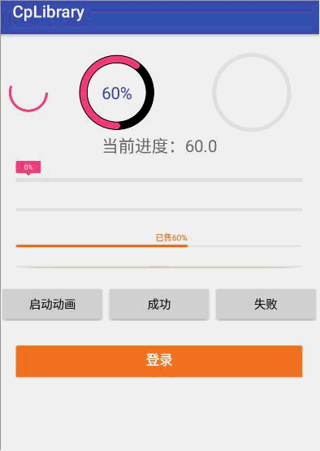

# CpLibrary
Android 通用工具类 版本1.0.0
一、项目依赖方式
 	project的build.gradle中添加
         allprojects {
            repositories {
                ...
                maven { url 'https://jitpack.io' }
            }
        }
    需要引用的module的build.gradle中添加
            dependencies {
                implementation 'com.github.ChrisLeeLcx:CpLibrary:1.0.0'
	}

二、项目依赖库版本号
    # 当前targetSdkVersion sdk
    TARGET_SDK_VERSION=27
    # 构建工具的版本，其中包括了打包工具aapt、dx等,如API20对应的build-tool的版本就是20.0.0
    BUILDTOOLS_VERSION=28.0.1
    # 最小支持sdk
    MIN_SDK_VERSION=16
    # 支持包的版本-通常support:appcompat-v7、recyclerview、design需要与targetSdkVersion、compileSdkVersion版本一致 27.3.1
    SUPPORT_LIB_VERSION=27.1.1
    # constraint-layout
    CONSTRAINT_LAYOUT_VERSION=1.1.2

     cplibrary的build.gradle中依赖库
         compile 'com.google.android:flexbox:0.2.3'
         compile "com.android.support:recyclerview-v7:27.1.1"
         compile "com.android.support:design:27.1.1"
         compile 'com.nineoldandroids:library:2.4.0'//基本动画库
    module中依赖
        compile "com.android.support:appcompat-v7:27.1.1"
        implementation project(':cplibrary')

