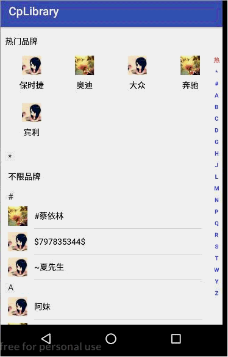

# CpLibrary
## Android 通用工具类 版本1.0.0  
一、项目依赖方式  
 
 	project的build.gradle中添加
         allprojects {
            repositories {
                ...
                maven { url 'https://jitpack.io' }
            }
        }
    需要引用的module的build.gradle中添加
            dependencies {
                implementation 'com.github.ChrisLeeLcx:CpLibrary:1.0.0'
	}
 

二、项目依赖库版本号
    当前targetSdkVersion sdk  
    TARGET_SDK_VERSION=27  
     构建工具的版本，其中包括了打包工具aapt、dx等,如API20对应的build-tool的版本就是20.0.0  
    BUILDTOOLS_VERSION=28.0.1  
      最小支持sdk   
    MIN_SDK_VERSION=16  
     支持包的版本-通常support:appcompat-v7、recyclerview、design需要与targetSdkVersion、compileSdkVersion版本一致 27.3.1  
    SUPPORT_LIB_VERSION=27.1.1  
   constraint-layout ：  CONSTRAINT_LAYOUT_VERSION=1.1.2

     cplibrary的build.gradle中依赖库
         compile 'com.google.android:flexbox:0.2.3'
         compile "com.android.support:recyclerview-v7:27.1.1"
         compile "com.android.support:design:27.1.1"
         compile 'com.nineoldandroids:library:2.4.0'//基本动画库
    module中依赖
        compile "com.android.support:appcompat-v7:27.1.1"
        implementation project(':cplibrary')

## 版本 1.0.3  
1、优化了底部列表dialog代码 ，增加了底部普通顶部圆角的dialog 样式  
2、增加城市选择器设置显示哪几个省份，初始化显示省市区的功能  
3、ImageUtils增加合并图片功能，图片设置.png后缀的功能  
4、增加EditTextUtil工具类，优化了ViewUtil  

## 版本 1.0.4  
1、修复1.0.3版本中 dialog圆角适配问题

## 版本 1.0.4.1  
1、增加地址选择器标题栏外观设置 

## 版本 1.0.4.2    
1、1个和2个按钮的通用对话框增加padding设置功能

## 版本 1.0.4.3    
1、增加布局文件设置 SideBar 样式的属性  

## 版本1.0.4.4 
1、增加拍照质量的和宽高比例的设置 增加Activity的栈列表的获取 EditText获取焦点并显示软键盘

## 版本1.0.4.5 
1、修复底部圆弧Dialog当数据项就1个时候 上圆下方的bug 

## 版本1.0.4.6
1、增加URLUtil工具类 2、增加跳转到系统功能界面的工具类 3、增加底部弹出对话框可修改取消按钮文本的功能

## 版本1.0.4.7
1、使用的数据需要调用者传入的增加地址选择器

## 版本1.0.4.8
1、增加对话框权重方法

## 版本1.0.4.9
1、增加设置排除美颜相机等第三方相机直接调用系统相机的处理方法

## 版本1.0.5.0
1、增加公历+农历选择器

## 图例展示  

	

